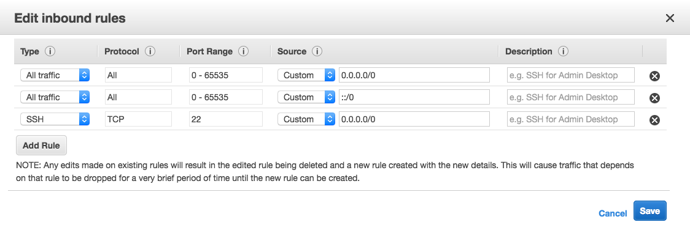

# Service

# Service目錄
* apache_rails     
    * [apache_rails](apache_rails.md)
* dns 
    * [dns](dns.md)
* samba 
    * [samba](samba.md)
* aws_rails  
    * [aws_rails](aws_rails.md) 

# Category 
Number | Title | Remark
-------|-------|------- 
1 | Linux |
2 | Linux-ubuntu |
3 | Nginx |
4 | Apache |
5 | AWS | 

# Linux基本操作指令
> https://wiki.ubuntu-tw.org/index.php?title=GNU/Linux_%E5%B8%B8%E7%94%A8%E6%8C%87%E4%BB%A4
``` 
//系統管理員身份 
sudo

// back 
cd .. 

ls

rm 

mv 

cp 

mkdir

find

in

//更改文件所有者
chown

//更改文件權限(數字 參數 資料夾)
chmod 

//新增使用者
adduser

//apt元件
apt-get xxx

//curl元件
curl xxx

// current
ln -s /Users/users/Siest/.../.../ current

//安裝ufw
sudo apt install ufw

//重設ufw
sudo ufw reset
```
 
# 此項唯獨AWS才要設定的
```
本地pem登入：
ssh -i "user.pem" ubuntu@ec2-ip-addr.us-west-2.compute.amazonaws.com

chmod 400 user.pem 

Online登入：
ssh username@ip-addr   

如果出現 warning: unprotected private key file! error 則輸入：
chmod 600 /path/to/user.pem

vim /root/.ssh/authorized_keys
刪除下面字段
command="echo 'Please login as the ec2-user user rather than root user.';echo;sleep 10
存檔離開

service sshd restart 
```

# 此項唯獨AWS設定 
> 設定入站(Inbound)與出站(Outbound)
 

# linux ubuntu Adduser & sshd
``` 
sudo su
adduser {username}
/etc/sudsers
/etc/ssh/sshd_config
service sshd restart
```

# install rvm & ruby on rails
```
apt upgrade 
apt update
apt install -y curl gnupg build-essential
apt install gnupg2 or sudo apt-get install gnupg2 -y
apt install curl

\curl -sSL https://get.rvm.io | bash
source /home/{username}/.rvm/scripts/rvm
source ~/.rvm/scripts/rvm
rvm requirements
gem install bundler
gem install rails -v {版本}
apt install rbenv
```

